# PLEASE USE THIS DOCUMENTATION FOR THE DOCX FILE OF TEJILO MCQ.....

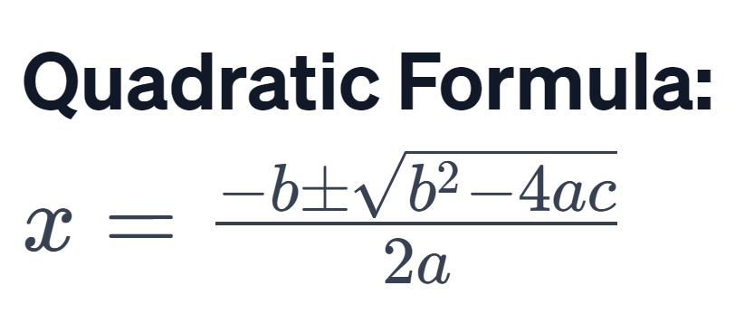

## SETUP

```latex
x = \frac{-b \pm \sqrt{b^2 - 4ac}}{2a}
```

---


## SETUP

```latex
A = \pi r^2
```

---


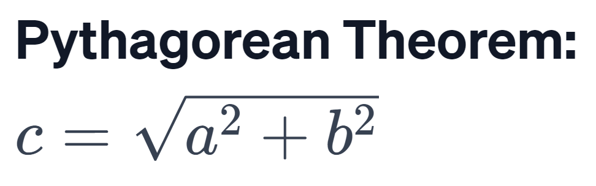

## SETUP

```latex
c = \sqrt{a^2 + b^2}
```
---


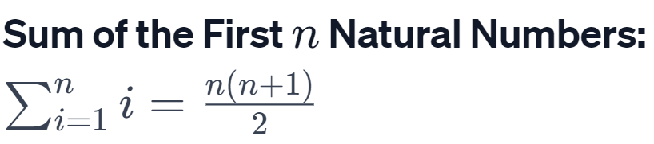

## SETUP

```latex
\sum_{i=1}^{n} i = \frac{n(n + 1)}{2}
```
---


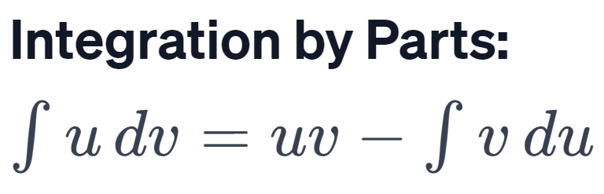

## SETUP \, is used to give small amount of space.

```latex
\int u \, dv = uv - \int v \, du
```

---


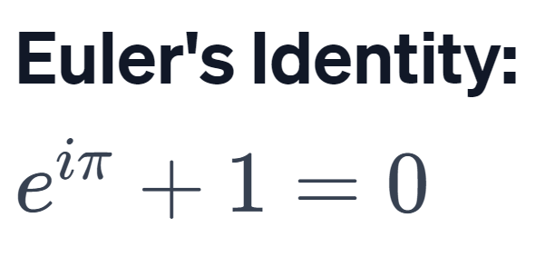

## SETUP

```latex
e^{i\pi} + 1 = 0
```
---


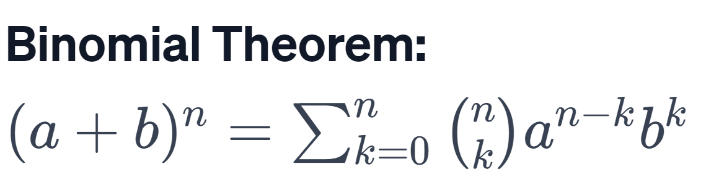

## SETUP

```latex
(a + b)^n = \sum_{k=0}^{n} \binom{n}{k} a^{n-k} b^k
```
---


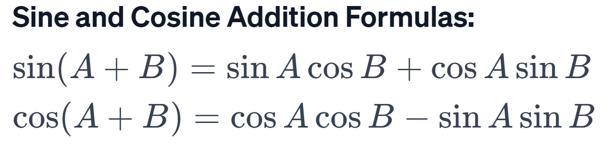

## SETUP

```latex
\sin(A + B) = \sin A \cos B + \cos A \sin B
```
```latex
\cos(A + B) = \cos A \cos B - \sin A \sin B
```
---


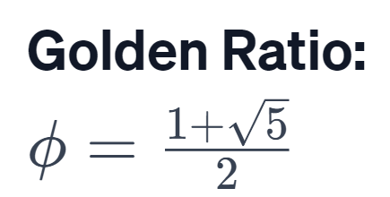

## SETUP

```latex
\phi = \frac{1 + \sqrt{5}}{2}
```
---


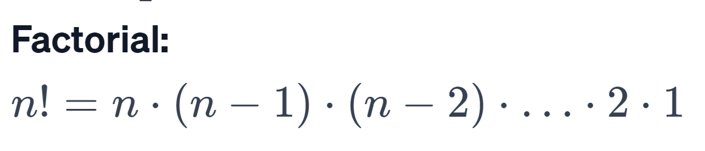

## SETUP

```latex
n! = n \cdot (n-1) \cdot (n-2) \cdot \ldots \cdot 2 \cdot 1
```
---


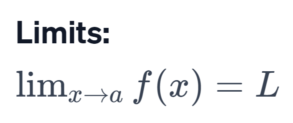

## SETUP

```latex
\lim_{{x \to a}} f(x) = L
```
---


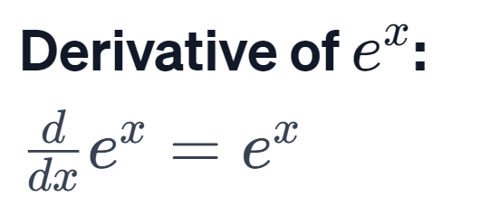

## SETUP

```latex
\frac{d}{dx} e^x = e^x
```

---


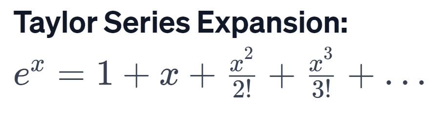

## SETUP

```latex
e^x = 1 + x + \frac{x^2}{2!} + \frac{x^3}{3!} + \ldots
```
---


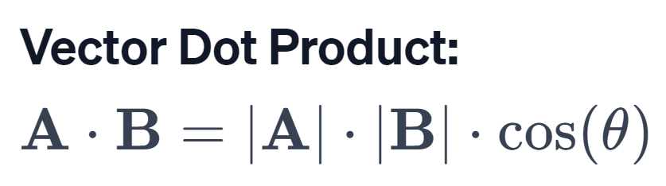

## SETUP

```latex
\mathbf{A} \cdot \mathbf{B} = |\mathbf{A}| \cdot |\mathbf{B}| \cdot \cos(\theta)
```
---


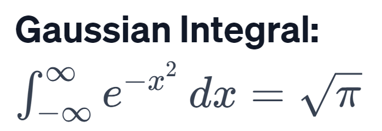

## SETUP

```latex
\int_{-\infty}^{\infty} e^{-x^2} \,dx = \sqrt{\pi}
```
---


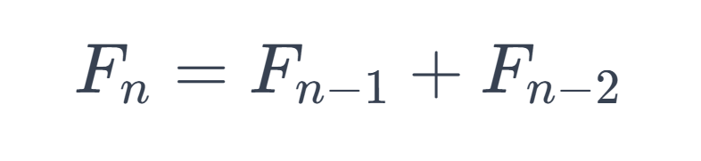

## SETUP

```latex
F_n = F_{n-1} + F_{n-2} 
```
---


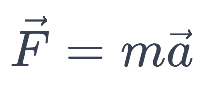

## SETUP

```latex
\vec{F} = m \vec{a}
```
---


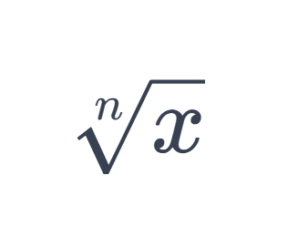

## SETUP

```latex
\sqrt[n]{x}
```


---


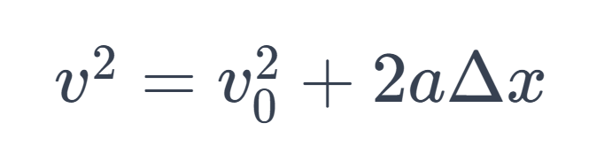

## SETUP

```latex
v^2 = v_0^2 + 2a\Delta X
```

---


## SETUP

```latex
\delta X is change in displacement
```
---


## SETUP

```latex
\alpha
```
```latex
\gamma
```
```latex
\beta
```
---


## SETUP

```latex
\lambda
```
```latex
\rho
```
---


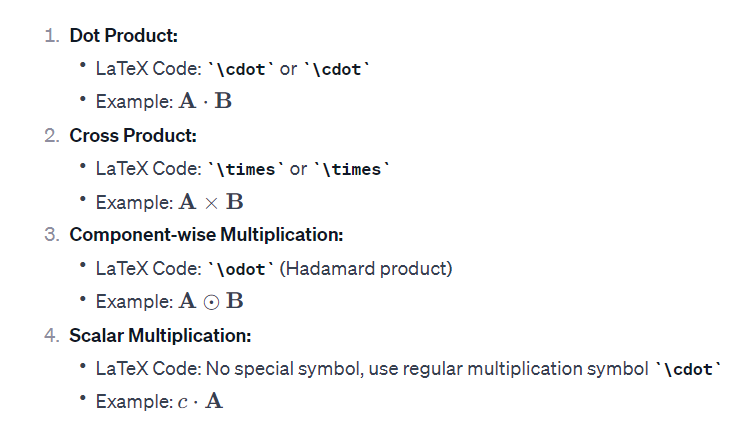


---


## SETUP

```latex
\tau = r \times F
```
---


## SETUP

```latex
\bar{x}
```


